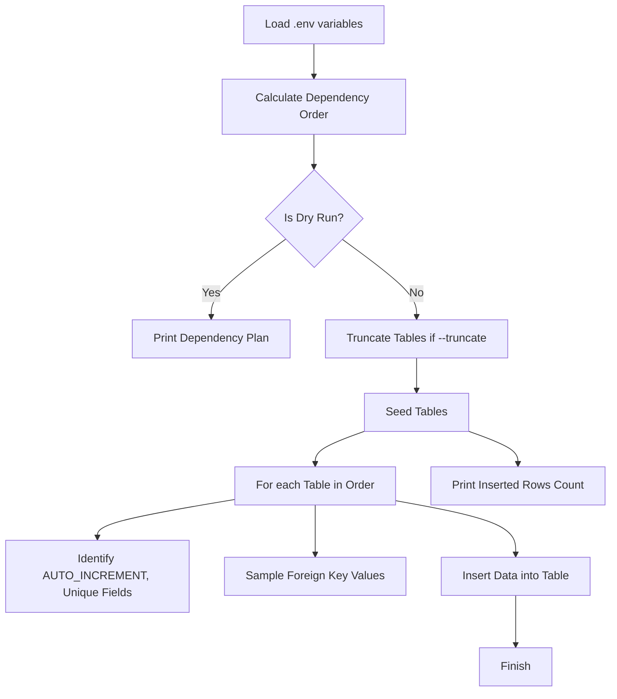

# SQL Agent Seeder

This project is designed to seed a MySQL database with fake data for testing or development purposes. The seeder ensures that data is inserted while respecting foreign key constraints, auto-increment fields, and unique column constraints.

## Table of Contents

1. [Overview](#overview)
2. [How to Use](#how-to-use)
   - [Customizing the Number of Rows](#customizing-the-number-of-rows)
   - [Running the Seeder](#running-the-seeder)
3. [Understanding the Code](#understanding-the-code)
   - [Function Flow Breakdown](#function-flow-breakdown)
   - [Mermaid Diagram](#mermaid-diagram)
4. [How the Seeder Works](#how-the-seeder-works)
   - [Environment Setup](#environment-setup)
   - [Dependency Order](#dependency-order)
   - [Seeding Process](#seeding-process)
   - [Foreign Key Handling](#foreign-key-handling)
5. [Customization](#customization)
   - [Changing the Number of Rows](#changing-the-number-of-rows)
   - [Customizing Column Values](#customizing-column-values)
6. [Troubleshooting](#troubleshooting)
7. [License](#license)

---

## Overview

The SQL Agent Seeder is designed to populate your MySQL database with realistic fake data, adhering to the following key principles:

- **Parent-child relationship:** The seeder respects the dependency between tables and inserts parent tables first (e.g., `users`, `products`) before inserting child tables (e.g., `orders`, `order_items`).
- **Foreign key constraints:** The seeder samples valid foreign key values from parent tables and inserts them into child tables.
- **Unique column values:** Ensures uniqueness for columns like `email`, `sku`, and `username`, which are marked with a `UNIQUE` constraint in MySQL.

---

## How to Use

### Customizing the Number of Rows

By default, the seeder will insert **200 rows** into each table. However, you can customize this number by passing the `--rows` argument when running the script. 

#### Example:

```bash
pipenv run python seed.py --schema demo_app --rows 500 --truncate
```

This command will insert **500 rows** into each table in the `demo_app` schema and will **truncate** the tables before starting.

You can also specify different row counts for individual tables:

```bash
pipenv run python seed.py --schema demo_app --rows default=1000,users=5000,orders=10000 --truncate
```

In this case:
- `default=1000` applies to all tables, except where otherwise specified.
- `users=5000` will insert **5000 rows** in the `users` table.
- `orders=10000` will insert **10000 rows** in the `orders` table.

### Running the Seeder

To run the seeder, follow these steps:

1. **Install dependencies:**
   Make sure you have installed all the required dependencies in your environment by running:
   ```bash
   pipenv install
   ```

2. **Set up your `.env` file:**
   Create a `.env` file in the root directory of your project, and include the following parameters:
   ```
   MYSQL_HOST=127.0.0.1
   MYSQL_PORT=3360 #This is for my setup, I had the default port 3306 already inuse
   MYSQL_USER=root
   MYSQL_PASSWORD=toor
   MYSQL_DB=demo_app
   FAKER_LOCALE=en_US
   SEED=42
   ```

3. **Run the seeder:**
   - To **see the dependency order** of tables (without inserting data):
     ```bash
     pipenv run python seed.py --schema demo_app --dry-run
     ```
   - To **truncate and seed data**:
     ```bash
     pipenv run python seed.py --schema demo_app --truncate
     ```

---

## Understanding the Code

### Function Flow Breakdown

#### 1. **Loading `.env`**:
   - The script loads the database connection details from the `.env` file using `load_dotenv()`.

#### 2. **Calculating Dependency Order** (`dependency_order`):
   - The `dependency_order` function calculates the correct order in which tables should be seeded. Parent tables (like `products` and `users`) are seeded first, and child tables (like `orders` and `order_items`) are seeded afterward to prevent foreign key violations.

#### 3. **Seeding Tables** (`seed_table`):
   - The `seed_table` function generates the fake data and inserts it into the specified table:
     - It skips **auto-increment primary key** columns.
     - For **foreign key columns**, it samples valid values from the parent table.
     - **Unique columns** like `email` and `sku` are ensured to be unique.

#### 4. **Truncate Tables** (`truncate_table`):
   - If the `--truncate` flag is provided, the script will clear all data from the specified tables before seeding new data.

---

### Mermaid Diagram

Below is a **Mermaid diagram** visualizing the function flow in the seeding process:

You can open this meramid diagram in tools like mermaid live etc i personally like makeing simple diagrams like that



### Diagram Explanation:
- **A**: Load the database connection details from `.env`.
- **B**: The script calculates the table seeding order based on parent-child relationships.
- **C**: If `--dry-run` is set, it will just print the table order without inserting any data.
- **D**: Print the dependency plan.
- **E**: If `--truncate` is provided, truncate the tables before starting the seeding process.
- **F**: The `seed_table` function is responsible for inserting data into the tables.
- **G**: For each table, it processes columns, ensures unique values, and samples foreign keys.
- **H**: Skips auto-incremented primary keys during data insertion.
- **I**: Sample valid foreign key values from parent tables.
- **J**: Inserts the data into the table.
- **K**: End of the seeding process.
- **L**: Print the number of rows inserted for each table.

---

## How the Seeder Works

### Environment Setup
The script reads configuration from the `.env` file for MySQL connection details (`MYSQL_HOST`, `MYSQL_PORT`, `MYSQL_USER`, etc.).

### Dependency Order
The `dependency_order` function orders tables in a way that respects **foreign key constraints**. Parent tables are seeded first, followed by child tables.

### Seeding Process
The `seed_table` function generates fake data for each table, skipping **auto-increment** primary keys and ensuring **foreign key integrity** by sampling valid values from parent tables.

### Foreign Key Handling
The seeder makes sure that foreign key columns in child tables are populated with valid IDs from the parent tables. This is done by sampling valid values from the parent tables before inserting the child data.

---

## Customization

### Changing the Number of Rows

To seed more than 200 rows, simply adjust the `--rows` flag when running the script. For example:

```bash
pipenv run python seed.py --schema demo_app --rows 1000 --truncate
```

### Customizing Column Values

You can customize the values generated for specific columns in the `faker_factories.py` file. The `value_for` function generates fake data for columns based on their type (e.g., `varchar`, `int`, `email`, etc.). If a column has a `UNIQUE` constraint, the script ensures the generated values are unique.

To make specific columns (like `email` or `sku`) generate values in a specific format, you can adjust the `value_for` function logic or add new conditions based on column names.

---

## Troubleshooting

### Error: Duplicate entry for key 'users.email'
This error occurs when Faker generates a duplicate value for a column that has a `UNIQUE` constraint, like `email`. The seeder ensures uniqueness for such columns by sampling a new value until it finds a unique one.

If you still encounter duplicate issues, ensure your database schema has been cleared (`--truncate`) before seeding new data.

---

## License

MIT License. See the [LICENSE](LICENSE) file for details.
